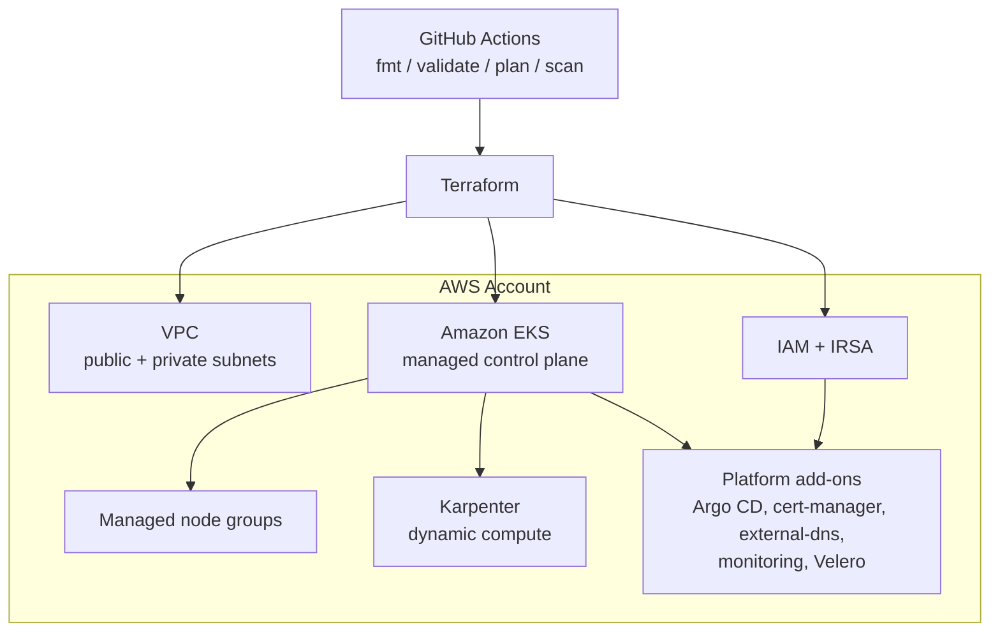
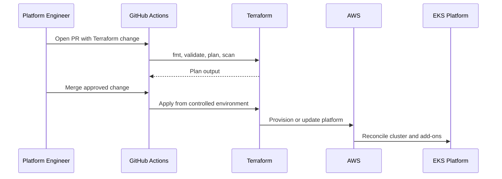

# Terraform EKS Platform

[](https://github.com/praveenbhatk8s/terraform-eks-platform/actions/workflows/terraform.yml)
[](https://github.com/praveenbhatk8s/terraform-eks-platform/actions/workflows/security-scan.yml)


Production-style AWS EKS platform built with Terraform modules, environment composition, GitHub Actions validation, and platform add-ons.

## What This Demonstrates

- Reusable Terraform modules for VPC, EKS, IRSA, and Karpenter
- Environment-based composition for dev, stage, and prod
- Private/public subnet platform networking
- Managed node groups and autoscaling foundation
- Argo CD bootstrap for GitOps operations
- Add-on values for cert-manager, external-dns, monitoring, Velero, and SSO
- CI validation for Terraform formatting, validation, planning, and security scanning

## Architecture



Detailed architecture: [docs/architecture.md](docs/architecture.md)

## Repository Layout

```text
.
├── .github/workflows/       # Terraform and security CI
├── addons/                  # Helm values for platform add-ons
├── bootstrap/               # Argo CD bootstrap helpers
├── docs/                    # Architecture, diagrams, runbooks
├── environments/            # dev, stage, prod compositions
└── modules/                 # reusable Terraform modules
```

## Modules

| Module | Purpose |
| --- | --- |
| `modules/vpc` | Network foundation for EKS |
| `modules/eks` | EKS cluster and node group primitives |
| `modules/irsa` | IAM Roles for Service Accounts |
| `modules/karpenter` | Autoscaling foundation |

## Environments

| Environment | Path |
| --- | --- |
| dev | `environments/dev` |
| stage | `environments/stage` |
| prod | `environments/prod` |

## Usage

From an environment directory:

```bash
cd environments/dev
terraform init
terraform fmt -recursive
terraform validate
terraform plan
terraform apply
```

Use the same workflow for `stage` and `prod`, with environment-specific variables and backend configuration as needed.

## CI/CD

This repo includes GitHub Actions workflows for:

- Terraform formatting and validation
- Terraform planning
- security scanning

Check:

```bash
.github/workflows/terraform.yml
.github/workflows/security-scan.yml
```

## Platform Add-ons

The `addons/` directory contains values for common EKS platform services:

- cert-manager
- external-dns
- monitoring
- SSO
- Velero backup and restore

## Operating Model



## Portfolio Notes

This repository is designed to show platform engineering judgement:

- modular infrastructure boundaries
- environment separation
- secure AWS identity patterns
- autoscaling readiness
- add-on lifecycle thinking
- CI gates before infrastructure changes
