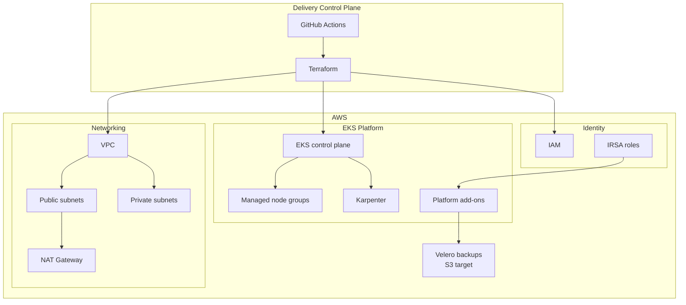
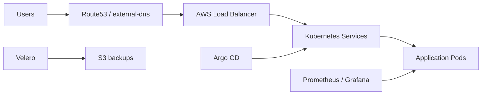

# Platform Architecture

This architecture represents a production-oriented EKS foundation. Terraform provisions the AWS primitives, EKS provides the Kubernetes control plane, and platform add-ons deliver GitOps, certificates, DNS, monitoring, and backup capabilities.

## Traffic and Operations

## Design Intent

| Layer | Intent |
| --- | --- |
| VPC | Provide isolated, multi-subnet network foundation |
| EKS | Host workloads on managed Kubernetes |
| Managed node groups | Provide baseline compute capacity |
| Karpenter | Add dynamic right-sized compute |
| IRSA | Avoid static cloud credentials in pods |
| Add-ons | Enable GitOps, DNS, certificates, monitoring, backup |
| CI | Validate infrastructure changes before merge/apply |
